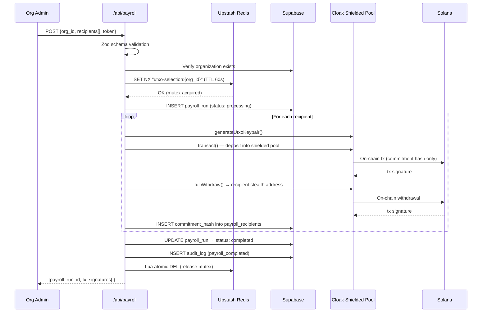
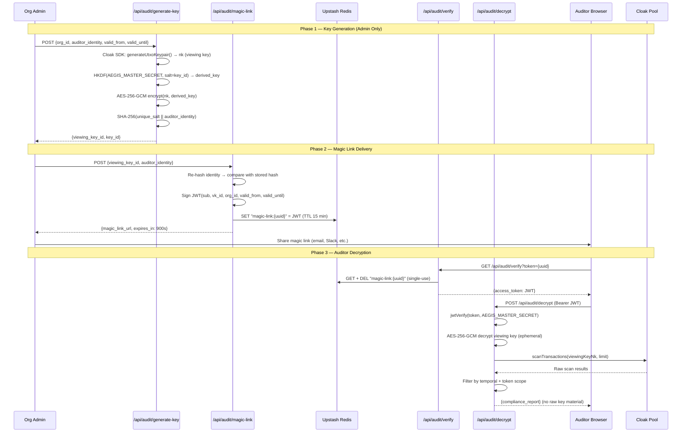

<p align="center">
  
  
  
  
</p>

<h1 align="center">⟐ Aegis Ledger</h1>
<p align="center"><strong>Zero-Knowledge Payroll & Treasury Disbursement Engine on Solana</strong></p>

<p align="center">
  <em>Execute batch USDC payrolls where amounts and recipient addresses are cryptographically hidden inside Cloak's shielded pool — while still giving regulators verifiable, time-scoped audit access.</em>
</p>

---

## The Problem: DAOs Are Telegraphing Strategy

Every DAO and on-chain company faces the same transparency paradox: **Solana's public ledger means your payroll is your competitor's intel.** When a DAO pays 50 contributors in USDC, anyone watching the treasury can:

- Reverse-engineer headcount and burn rate
- Identify key contributors by wallet clustering
- Front-run strategic hires by monitoring salary jumps
- Extract competitive intelligence from payment timing and amounts

**The result?** Organizations are forced to choose between the compliance requirements of transparent financial operations and the operational security of keeping payroll private. Aegis Ledger eliminates this tradeoff.

---

## The Solution: Shielded Payroll with Selective Auditability

Aegis Ledger is a **Next.js 14 monolith** that wraps the Cloak Protocol SDK to provide:

1. **Fully shielded batch payroll** — amounts and recipient addresses are hidden inside Cloak's UTXO-based shielded pool
2. **On-demand compliance** — time-scoped viewing keys let regulators selectively decrypt a subgraph of financial history *without* exposing the entire ledger

The public sees only UTXO commitment hashes and transaction signatures. An authorized auditor, equipped with a time-scoped viewing key, sees the full financial picture — amounts, recipients, and timestamps — for only the window they're authorized to view.

---

## Cloak SDK Integration — Four Core Features

Aegis Ledger leverages the following `@cloak.dev/sdk` primitives:

| Cloak Feature | How Aegis Uses It | File |
|---|---|---|
| **`transact()` — Shielded Deposits** | Each payroll recipient's USDC is deposited into Cloak's shielded pool via `createUtxo()` + `transact()`. The amount and destination are hidden on-chain — only UTXO commitment hashes are public. | `src/app/api/payroll/route.ts` |
| **`fullWithdraw()` — Private Withdrawals** | After deposit, `fullWithdraw()` sends the shielded USDC to the recipient's wallet via a stealth address. The withdrawal amount is never linked to the deposit on-chain. | `src/app/api/payroll/route.ts` |
| **`generateUtxoKeypair()` + `getNkFromUtxoPrivateKey()` — Viewing Key Generation** | The Cloak SDK generates a UTXO keypair; the nullifier key (`nk`) serves as the 32-byte viewing key for `scanTransactions`. Aegis encrypts this key with AES-256-GCM before storing it. | `src/app/api/audit/generate-key/route.ts` |
| **`scanTransactions()` + `toComplianceReport()` — Selective Decryption** | When an auditor presents a valid JWT, Aegis decrypts the viewing key in ephemeral memory and calls `scanTransactions()` to reveal only the transactions visible to that key within the authorized time window. | `src/app/api/audit/decrypt/route.ts` |

---

## Architecture

### System Overview

```
┌─────────────────────────────────────────────────────────────────┐
│                         NEXT.JS 14 MONOLITH                     │
│                                                                 │
│  ┌──────────────┐   ┌──────────────┐   ┌──────────────────┐    │
│  │ Public       │   │ Auditor      │   │ API Routes       │    │
│  │ Dashboard    │   │ Portal       │   │ (Server Only)    │    │
│  │              │   │              │   │                  │    │
│  │ • xterm.js   │   │ • ReactFlow  │   │ • /api/payroll   │    │
│  │ • SSE Stream │   │ • Magic Link │   │ • /api/audit/*   │    │
│  │ • ZK Proof   │   │ • JWT Auth   │   │ • /api/health    │    │
│  └──────┬───────┘   └──────┬───────┘   └────────┬─────────┘    │
│         │                  │                     │              │
│         └──────────────────┼─────────────────────┘              │
│                            │                                    │
│  ┌─────────────────────────┼────────────────────────────────┐   │
│  │                   LIB LAYER                               │   │
│  │  crypto.ts · redis.ts · cloak.ts · validation.ts          │   │
│  └─────────────────────────┼────────────────────────────────┘   │
└────────────────────────────┼────────────────────────────────────┘
                             │
          ┌──────────────────┼──────────────────┐
          │                  │                  │
   ┌──────┴──────┐    ┌─────┴─────┐     ┌──────┴──────┐
   │  Supabase   │    │  Upstash  │     │   Cloak     │
   │ PostgreSQL  │    │   Redis   │     │  Shielded   │
   │             │    │           │     │    Pool     │
   │ • orgs      │    │ • Mutex   │     │  (Solana)   │
   │ • runs      │    │ • Magic   │     │             │
   │ • keys      │    │   Links   │     │ • Deposit   │
   │ • audit_log │    │ • TTL     │     │ • Withdraw  │
   └─────────────┘    └───────────┘     │ • Scan      │
                                        └─────────────┘
```

### Payroll Execution Flow



### Audit Key Lifecycle



---

## Security Architecture

### The Five Layers

| Layer | Mechanism | Purpose |
|---|---|---|
| **Concurrency** | Redis `SET NX` mutex with atomic Lua release | Prevents double-spend from concurrent UTXO selection on the same org |
| **Encryption** | AES-256-GCM with HKDF-SHA256 key derivation | Viewing keys are encrypted at rest; master secret never touches the DB |
| **Identity** | Per-auditor unique salt + SHA-256 hash | No plaintext auditor identity stored; no global pepper; no rainbow table attacks |
| **Session** | Stateless JWT (HS256) + single-use Redis magic links | No sessions table; JWT scope enforced at 3 levels (JWT exp, DB check, runtime filter) |
| **Database** | PostgreSQL `CHECK` constraints + RLS policies | Temporal bounds, token scope, and non-empty arrays enforced at the schema level |

### Key Security Invariants

```
✓ Raw viewing key (nk) exists ONLY in ephemeral server memory — never persisted, never sent to client
✓ AEGIS_MASTER_SECRET lives ONLY in env vars — never in the database, never in logs
✓ Magic links are single-use: Redis DEL after first read — no replay attacks
✓ JWT stored in browser memory only — never localStorage (XSS-resistant)
✓ Each auditor gets a unique cryptographic salt — not a global pepper
✓ Temporal scope enforced at DB level (CHECK constraint), JWT level (exp), AND runtime (filter)
✓ Treasury keypair loaded from filesystem — never hardcoded, never in env vars as string
```

---

## Tech Stack

| Layer | Technology | Why |
|---|---|---|
| **Framework** | Next.js 14 (App Router) | Monolith — API routes + SSR in one deployment |
| **Privacy** | `@cloak.dev/sdk` | Solana's UTXO-based shielded pool for private transactions |
| **Blockchain** | `@solana/web3.js` | Solana RPC connection + keypair management |
| **Database** | Supabase (PostgreSQL) | RLS-enforced persistent storage with typed queries |
| **Cache/Locks** | Upstash Redis | Distributed mutex (SET NX) + ephemeral magic link storage |
| **Auth** | `jose` (JWT) | Stateless audit sessions with HMAC-SHA256 signing |
| **Validation** | Zod | Runtime schema validation on all API inputs |
| **Terminal UI** | `@xterm/xterm` + `@xterm/addon-fit` | Hacker-style payroll log streaming |
| **Graph UI** | ReactFlow | Interactive UTXO encryption → decryption visualization |
| **Styling** | Tailwind CSS v3 | Dark-mode glassmorphism design system |

---

## Getting Started

### Prerequisites

- Node.js 18+
- npm
- Solana CLI (`solana-keygen`)
- Supabase project (with migration applied)
- Upstash Redis instance

### 1. Clone & Install

```bash
git clone https://github.com/YOUR_USERNAME/aegis-ledger.git
cd aegis-ledger
npm install
```

### 2. Generate Treasury Keypair

```bash
# Generate a devnet keypair in the project root
solana-keygen new --outfile ./treasury-keypair.json --no-bip39-passphrase

# Get your public key
solana-keygen pubkey ./treasury-keypair.json

# Fund with devnet SOL (run 2-3 times)
solana airdrop 5 <YOUR_PUBKEY> --url devnet
```

### 3. Configure Environment

Copy `.env.example` to `.env.local` and populate:

```bash
cp .env.example .env.local
```

| Variable | Source |
|---|---|
| `SOLANA_RPC_URL` | `https://api.devnet.solana.com` |
| `CLOAK_RELAY_URL` | `https://api.cloak.ag` |
| `TREASURY_KEYPAIR_PATH` | **Absolute path** to `treasury-keypair.json` |
| `NEXT_PUBLIC_SUPABASE_URL` | Supabase Dashboard → Settings → API |
| `NEXT_PUBLIC_SUPABASE_ANON_KEY` | Supabase Dashboard → Settings → API |
| `SUPABASE_SERVICE_ROLE_KEY` | Supabase Dashboard → Settings → API |
| `UPSTASH_REDIS_REST_URL` | Upstash Console |
| `UPSTASH_REDIS_REST_TOKEN` | Upstash Console |
| `AEGIS_MASTER_SECRET` | Generate: `node -e "console.log(require('crypto').randomBytes(32).toString('hex'))"` |

### 4. Apply Database Migration

In Supabase Dashboard → SQL Editor, paste and run `supabase/migrations/001_foundation.sql`.

### 5. Seed an Organization

```sql
INSERT INTO organizations (name, treasury_pubkey)
VALUES ('Aegis DAO', '<YOUR_TREASURY_PUBKEY>');
```

### 6. Run

```bash
npm run dev
```

| Page | URL |
|---|---|
| **Public Dashboard** (Zero-Knowledge View) | `http://localhost:3000` |
| **Auditor Portal** (God Mode View) | `http://localhost:3000/audit` |

---

## Project Structure

```
aegis-ledger/
├── src/
│   ├── app/
│   │   ├── api/
│   │   │   ├── payroll/
│   │   │   │   ├── route.ts            # POST — batch shielded payroll
│   │   │   │   ├── [id]/route.ts       # GET  — payroll run status
│   │   │   │   └── stream/route.ts     # GET  — SSE terminal log stream
│   │   │   ├── audit/
│   │   │   │   ├── generate-key/route.ts  # POST — create encrypted viewing key
│   │   │   │   ├── magic-link/route.ts    # POST — create single-use audit link
│   │   │   │   ├── verify/route.ts        # GET  — consume magic link → JWT
│   │   │   │   └── decrypt/route.ts       # POST — decrypt + scan shielded pool
│   │   │   └── health/route.ts         # GET  — service health check
│   │   ├── audit/page.tsx              # Auditor Portal (ReactFlow)
│   │   ├── page.tsx                    # Public Dashboard (xterm.js)
│   │   ├── layout.tsx                  # Root layout + SEO
│   │   └── globals.css                 # Design system
│   ├── components/
│   │   ├── PayrollTerminal.tsx         # xterm.js terminal component
│   │   └── AuditGraph.tsx              # ReactFlow graph component
│   ├── lib/
│   │   ├── crypto.ts                   # AES-256-GCM + HKDF + identity hashing
│   │   ├── redis.ts                    # Redis client + SET NX mutex
│   │   ├── cloak.ts                    # Solana connection + Cloak factory
│   │   ├── validation.ts              # Zod schemas for all API inputs
│   │   └── supabase/
│   │       ├── server.ts               # Server-side Supabase client
│   │       └── client.ts              # Browser-side Supabase client
│   └── types/
│       └── database.ts                 # TypeScript ↔ PostgreSQL schema types
├── supabase/
│   └── migrations/
│       └── 001_foundation.sql          # Full schema with RLS + CHECK constraints
├── .env.example                        # Environment variable template
└── package.json
```

---

## Demo Flow for Judges

### Scene 1 — The Zero-Knowledge View (`/`)
1. Click **"Execute Payroll"** on the Public Dashboard
2. Watch the xterm.js terminal stream a 5-recipient batch payroll
3. Observe: amounts show `████████████` (redacted), recipients show `████████████████████` (redacted)
4. Only commitment hashes and transaction signatures are visible
5. **Key line:** `[SHIELDED] Amount: HIDDEN | Recipient: HIDDEN`

### Scene 2 — The God Mode View (`/audit`)
1. Navigate to the Auditor Portal
2. Click **"Enter Demo Mode"** (simulates a verified magic link)
3. See the ReactFlow graph with 5 **locked** UTXO nodes (🔒 red borders, ciphertext hashes)
4. Click **"Apply Viewing Key"**
5. Watch each node transform in sequence: 🔒 → 🔓 with amounts + recipient labels revealed
6. Edges animate from purple to green (encrypted → decrypted)

**The visual contrast between Scene 1 and Scene 2 is the entire pitch:** same data, same transactions, but only the authorized auditor sees the full picture.

---

## License

MIT

---

<p align="center">
  <strong>Built for Colosseum Frontier Hackathon · Cloak Track</strong><br/>
  <em>Solana · Cloak Protocol · Next.js 14</em>
</p>
