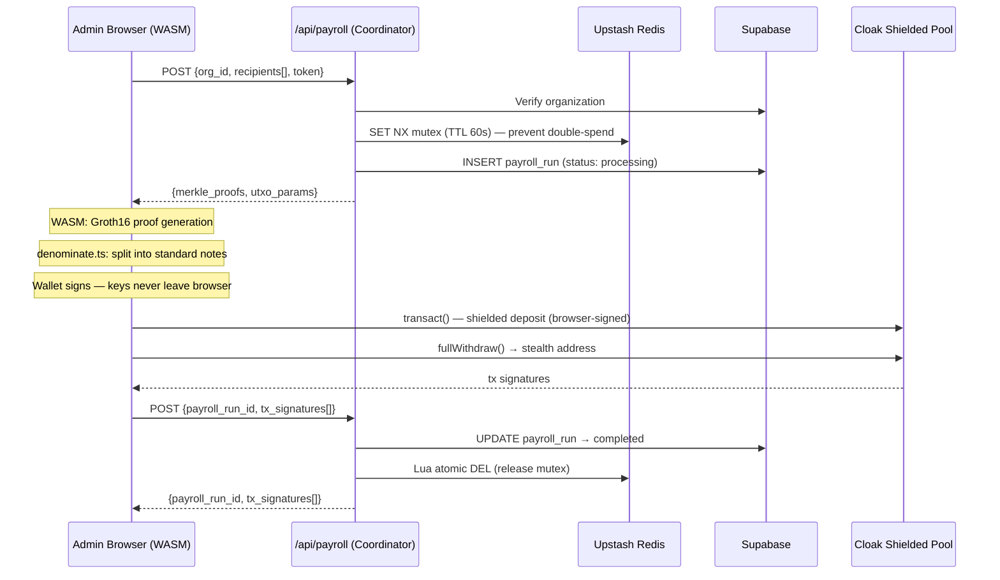
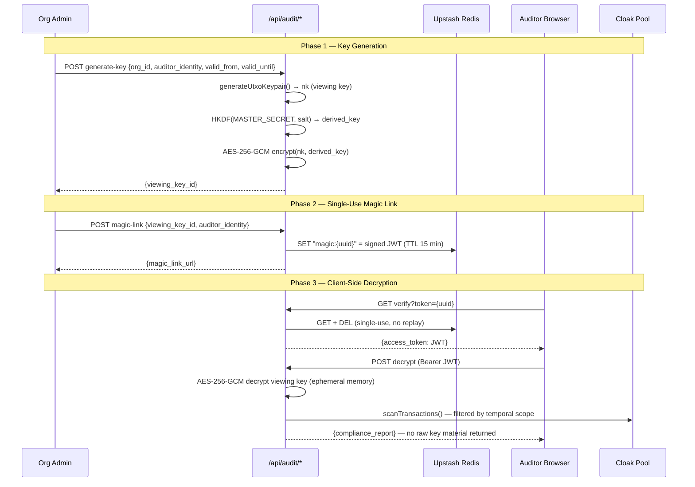

<p align="center">


</p>

<h1 align="center">⟐ Aegis Ledger</h1>
<p align="center"><strong>Zero-Knowledge Payroll & Treasury Disbursement Engine on Solana</strong></p>

<p align="center">
<em>Execute batch USDC payrolls where amounts and recipient addresses are cryptographically hidden inside Cloak's shielded pool — while giving regulators verifiable, time-scoped audit access. ZK proof generation and wallet signing happen exclusively in the user's browser. The server never touches your keys.</em>
</p>

-----

## The Problem: DAOs Are Telegraphing Strategy

Every DAO and on-chain company faces the same transparency paradox: **Solana’s public ledger means your payroll is your competitor’s intel.**

When a DAO pays 50 contributors in USDC, anyone watching the treasury can:

- Reverse-engineer headcount and burn rate
- Identify key contributors by wallet clustering
- Front-run strategic hires by monitoring salary jumps
- Extract competitive intelligence from payment timing and amounts

The naive solution is to move payroll off-chain. But that abandons the composability, auditability, and programmability that make on-chain treasuries valuable in the first place.

**Aegis Ledger eliminates this tradeoff** — private by default, auditable on demand, and non-custodial by design.

-----

## The Solution: Zero-Trust Shielded Payroll

Aegis Ledger wraps the Cloak Protocol SDK in a **non-custodial, zero-trust architecture** where the server acts only as a data coordinator. It delivers Merkle proofs and UTXO parameters to the browser — but ZK proof generation (Groth16) and wallet signing happen exclusively client-side via WASM. Your keys and your cryptographic operations never leave your machine.

The result: on-chain payroll that is private to observers, verifiable to regulators, and trustless by construction.

-----

## Core Features

### 1. Non-Custodial ZK Signing

The `usePayrollSigner` hook is the brain of the execution pipeline. It orchestrates WASM-based Groth16 proof generation and wallet signing inside the browser, consuming Merkle proofs and UTXO parameters delivered by the API — without the server ever seeing a private key or an unencrypted proof.

### 2. Note Denomination Splitting

Sending a unique amount like `312.89 USDC` creates an on-chain fingerprint — a single data point an observer can use to isolate and identify a transaction. Aegis eliminates this through **metadata protection via note splitting**: each payment is decomposed into standard denomination notes (`100`, `10`, `5`, `1`, `0.1`) before shielding. The transaction blends into the crowd.

> *A salary of $5,000 becomes 5 × $1,000 notes — indistinguishable from any other five-note deposit in the shielded pool.*

This is handled by the `denominate.ts` utility in the live signing path and runs entirely on the client.

### 3. Fully Shielded Batch Payroll

Each recipient’s USDC is deposited into Cloak’s UTXO-based shielded pool via `createUtxo()` + `transact()`. After deposit, `fullWithdraw()` sends the shielded USDC to the recipient’s stealth address. The amount and destination are never linked on-chain — only UTXO commitment hashes are public.

### 4. Selective Auditability with Time-Scoped Viewing Keys

Viewing keys are not global. An admin can issue a **time-scoped cryptographic viewing key** for a specific auditor, covering only a defined window (e.g., Q1 2026). The key is:

- Encrypted at rest using **AES-256-GCM** with a key derived via **HKDF-SHA256** from `AEGIS_MASTER_SECRET`
- Delivered via a **single-use magic link** (Redis TTL, consumed on first read)
- Enforced at three independent layers: JWT expiry, database `CHECK` constraints, and runtime filter

Even if the database is fully compromised, the encrypted viewing keys are useless without the master secret — which never touches persistent storage.

### 5. Employee Note Scanner (Client-Side Merkle Scan)

Employees paste a scoped viewing key into the Employee Portal. The browser performs a **local Merkle leaf scan** — downloading the shielded tree and proving which leaves belong to the user without ever revealing which transactions it is looking for to the server. The same cryptographic primitive used by privacy protocols like Railgun, applied here in a compliance-first context.

Each decrypted payslip includes a **Privacy Audit modal** showing a side-by-side view:

- **Public View:** redacted commitment hashes, hidden amounts
- **Authorized View:** plaintext amounts, recipients, timestamps

### 6. Real-First Relay Strategy

The API routes (`/api/payroll`, `/api/treasury/swap-quote`) always attempt live execution against the Cloak Relay and DEX aggregators (Jupiter/Orca) first. Only if the network or devnet relay is unreachable does Aegis fall back to a high-fidelity simulation. The demo never fails. The architecture is **relay-agnostic** — switching between the Cloak devnet relay and a local simulation requires no code changes.

-----

## Architecture

### Zero-Trust Execution Model

```
┌──────────────────────────────────────────────────────────────┐
│ USER'S BROWSER │
│ │
│ usePayrollSigner.ts │
│ ├── WASM: Groth16 ZK Proof Generation │
│ ├── Wallet Signing (never leaves browser) │
│ └── denominate.ts — Note Denomination Splitting │
│ │
│ useAuditorEngine.ts useNoteScanner.ts │
│ ├── Temporal Scrubbing ├── Local Merkle Leaf Scan │
│ └── ReactFlow Graph └── Privacy Audit Modal │
└──────────────────────────────┬───────────────────────────────┘
│ Merkle Proofs + UTXO Params
│ (no keys, no raw proofs)
┌──────────────────────────────▼───────────────────────────────┐
│ NEXT.JS 14 SERVER │
│ (Data Coordinator — Zero Trust) │
│ │
│ /api/payroll /api/treasury/swap-quote │
│ /api/audit/generate-key /api/audit/magic-link │
│ /api/audit/verify /api/audit/decrypt │
└────────────┬─────────────────────────┬───────────────────────┘
│ │
┌──────────▼──────────┐ ┌─────────▼──────────┐ ┌──────────────┐
│ Supabase │ │ Upstash Redis │ │ Cloak │
│ PostgreSQL │ │ │ │ Shielded │
│ │ │ • SET NX Mutex │ │ Pool │
│ • orgs │ │ • Magic Links (TTL) │ │ (Solana) │
│ • payroll_runs │ │ • Rate Limiting │ │ │
│ • encrypted keys │ └─────────────────────┘ │ • transact()│
│ • audit_log │ │ • withdraw()│
└─────────────────────┘ │ • scan() │
└──────────────┘
```

### Payroll Execution Flow



### Audit Key Lifecycle



-----

## Security Architecture

### Five Layers of Defense

|Layer |Mechanism |Guarantee |
|----------------------|--------------------------------------------|----------------------------------------------------------|
|**Non-Custodial** |WASM ZK proving + wallet signing in browser |Server has zero access to keys or raw proofs |
|**Concurrency** |Redis `SET NX` mutex, atomic Lua release |Prevents double-spend from concurrent UTXO selection |
|**Encryption at Rest**|AES-256-GCM + HKDF-SHA256 key derivation |Viewing keys are useless without `AEGIS_MASTER_SECRET` |
|**Identity** |Per-auditor unique salt + SHA-256 hash |No plaintext identity stored; no rainbow table attacks |
|**Session** |Stateless JWT + single-use Redis magic links|No sessions table; enforced at JWT, DB, and runtime levels|

### Key Security Invariants

```
✓ ZK proof generation and wallet signing happen exclusively in the browser via WASM
✓ Raw viewing key (nk) exists ONLY in ephemeral server memory — never persisted, never sent to client
✓ AEGIS_MASTER_SECRET lives ONLY in env vars — never in the database, never in logs
✓ Magic links are single-use: Redis DEL on first read — no replay attacks
✓ JWT stored in browser memory only — never localStorage (XSS-resistant)
✓ Each auditor gets a unique cryptographic salt — not a global pepper
✓ Temporal scope enforced at DB (CHECK constraint), JWT (exp), AND runtime (filter) — three independent layers
✓ Relay-agnostic: switches between Cloak devnet relay and local simulation without code changes
```

-----

## Tech Stack

|Layer |Technology |Why |
|--------------------------|--------------------------------------------------------|----------------------------------------------------------------|
|**Framework** |Next.js 14 (App Router) |Monolith — API routes + SSR in one deployment |
|**ZK Proving** |WASM (Groth16) via `usePayrollSigner` |Client-side proof generation — server never sees raw proofs |
|**Privacy SDK** |`@cloak.dev/sdk-devnet` |Solana’s UTXO-based shielded pool |
|**Denomination Splitting**|`denominate.ts` |Metadata protection — standard note sizes prevent fingerprinting|
|**Blockchain** |`@solana/web3.js` |Solana RPC + keypair management |
|**Database** |Supabase (PostgreSQL) |RLS-enforced storage with typed queries |
|**Cache / Locks** |Upstash Redis |Distributed mutex (SET NX) + magic link TTL storage |
|**Auth** |`jose` (JWT, HS256) |Stateless audit sessions |
|**State Machines** |`useAuditorEngine`, `useNoteScanner`, `usePayrollSigner`|ZK proving state management across async WASM operations |
|**Terminal UI** |`@xterm/xterm` + SSE |Real-time cryptographic execution log |
|**Graph UI** |ReactFlow |UTXO encryption → decryption visualization + temporal scrubbing |
|**Styling** |Vanilla CSS (`aegis-tokens.css`) |Custom glassmorphism design system — no utility class overhead |
|**Validation** |Zod |Runtime schema validation on all API inputs |

-----

## Demo Flow for Judges

### Scene 1 — Public Dashboard (`/`) — The Zero-Knowledge View

1. Click **“Execute Payroll”**
1. Watch the xterm.js terminal stream a 5-recipient batch payroll in real time
1. Observe redacted output: `[SHIELDED] Amount: ████████ | Recipient: ████████████████████`
1. Only UTXO commitment hashes and transaction signatures are visible on-chain
1. The **Privacy Score** meter updates dynamically as each note clears

### Scene 2 — Auditor Portal (`/audit`) — The God Mode View

1. Navigate to the Auditor Portal
1. Click **“Enter Demo Mode”** — simulates a verified magic link session
1. See 5 **locked** UTXO nodes in the ReactFlow graph (🔒 red borders, ciphertext hashes)
1. Use the **Date Scope Slider** to scrub the Q1–Q4 2026 timeline to the relevant window
1. Click **“Apply Viewing Key”**
1. Watch each node unlock in sequence — amounts and recipient labels revealed
1. Edges animate from purple to green: encrypted → decrypted

### Scene 3 — Admin Dashboard — Issuing Access

1. Open the **“Issue Access Magic Link”** card
1. Generate a real, copyable cryptographic viewing key with a defined time scope
1. Copy the magic link — share it with the auditor via any channel
1. Demonstrate the single-use consumption: the link expires after first access

**The contrast between Scene 1 and Scene 2 is the product:** same transactions on the same chain, but only the authorized party sees the full picture.

-----

## Getting Started

### Prerequisites

- Node.js 18+
- Solana CLI (`solana-keygen`)
- Supabase project
- Upstash Redis instance

### 1. Clone & Install

```bash
git clone https://github.com/YOUR_USERNAME/aegis-ledger.git
cd aegis-ledger
npm install
```

### 2. Generate Treasury Keypair

```bash
solana-keygen new --outfile ./treasury-keypair.json --no-bip39-passphrase
solana airdrop 5 <YOUR_PUBKEY> --url devnet # run 2–3 times
```

### 3. Configure Environment

```bash
cp .env.example .env.local
```

|Variable |Source |
|-------------------------------|--------------------------------------------------------------------------|
|`SOLANA_RPC_URL` |`https://api.devnet.solana.com` |
|`CLOAK_RELAY_URL` |`https://api.cloak.ag` |
|`TREASURY_KEYPAIR_PATH` |Absolute path to `treasury-keypair.json` |
|`NEXT_PUBLIC_SUPABASE_URL` |Supabase Dashboard → Settings → API |
|`NEXT_PUBLIC_SUPABASE_ANON_KEY`|Supabase Dashboard → Settings → API |
|`SUPABASE_SERVICE_ROLE_KEY` |Supabase Dashboard → Settings → API |
|`UPSTASH_REDIS_REST_URL` |Upstash Console |
|`UPSTASH_REDIS_REST_TOKEN` |Upstash Console |
|`AEGIS_MASTER_SECRET` |`node -e "console.log(require('crypto').randomBytes(32).toString('hex'))"`|

### 4. Apply Database Migration

In Supabase Dashboard → SQL Editor, run `supabase/migrations/001_foundation.sql`.

### 5. Seed an Organization

```sql
INSERT INTO organizations (name, treasury_pubkey)
VALUES ('Aegis DAO', '<YOUR_TREASURY_PUBKEY>');
```

### 6. Run

```bash
npm run dev
```

|Page |URL |
|------------------------------------------|-----------------------------|
|**Public Dashboard** (Zero-Knowledge View)|`http://localhost:3000` |
|**Auditor Portal** (God Mode View) |`http://localhost:3000/audit`|

-----

## Project Structure

```
aegis-ledger/
├── src/
│ ├── app/
│ │ ├── api/
│ │ │ ├── payroll/
│ │ │ │ ├── route.ts # POST — batch shielded payroll (coordinator)
│ │ │ │ ├── [id]/route.ts # GET — payroll run status
│ │ │ │ └── stream/route.ts # GET — SSE terminal log stream
│ │ │ ├── treasury/
│ │ │ │ └── swap-quote/route.ts # GET — Jupiter/Orca DEX quote (real-first)
│ │ │ ├── audit/
│ │ │ │ ├── generate-key/route.ts # POST — create AES-encrypted viewing key
│ │ │ │ ├── magic-link/route.ts # POST — create single-use audit link
│ │ │ │ ├── verify/route.ts # GET — consume magic link → JWT
│ │ │ │ └── decrypt/route.ts # POST — ephemeral decrypt + Merkle scan
│ │ │ └── health/route.ts # GET — service health check
│ │ ├── audit/page.tsx # Auditor Portal (ReactFlow + temporal scrubbing)
│ │ ├── page.tsx # Public Dashboard (xterm.js + privacy score)
│ │ ├── layout.tsx
│ │ └── globals.css
│ ├── components/
│ │ ├── PayrollTerminal.tsx # xterm.js real-time cryptographic log
│ │ └── AuditGraph.tsx # ReactFlow UTXO graph visualization
│ ├── hooks/
│ │ ├── usePayrollSigner.ts # WASM ZK proving + wallet signing (client-side)
│ │ ├── useAuditorEngine.ts # Auditor state machine + temporal filtering
│ │ └── useNoteScanner.ts # Local Merkle leaf scan + privacy audit modal
│ ├── lib/
│ │ ├── crypto.ts # AES-256-GCM + HKDF + identity hashing
│ │ ├── denominate.ts # Note denomination splitting utility
│ │ ├── redis.ts # Redis client + SET NX mutex
│ │ ├── cloak.ts # Solana connection + Cloak factory
│ │ ├── validation.ts # Zod schemas for all API inputs
│ │ └── supabase/
│ │ ├── server.ts
│ │ └── client.ts
│ └── types/
│ └── database.ts # TypeScript ↔ PostgreSQL schema types
├── styles/
│ └── aegis-tokens.css # Custom glassmorphism design system
├── supabase/
│ └── migrations/
│ └── 001_foundation.sql # Full schema with RLS + CHECK constraints
├── .env.example
└── package.json
```

-----

## License

MIT

-----

<p align="center">
<strong>Built for Colosseum Frontier Hackathon · Cloak Track</strong><br/>
<em>Solana · Cloak Protocol · Next.js 14 · Zero-Trust Architecture</em>
</p>